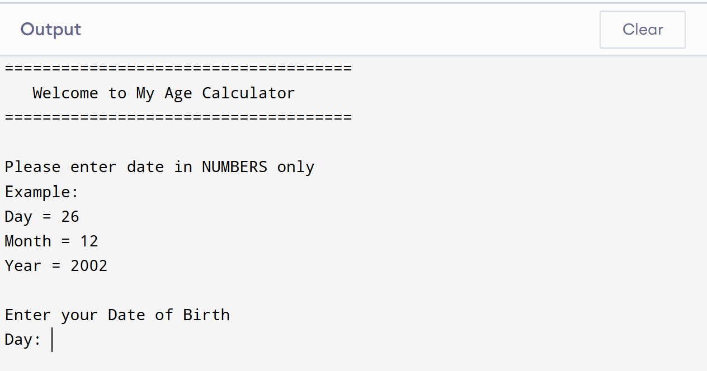
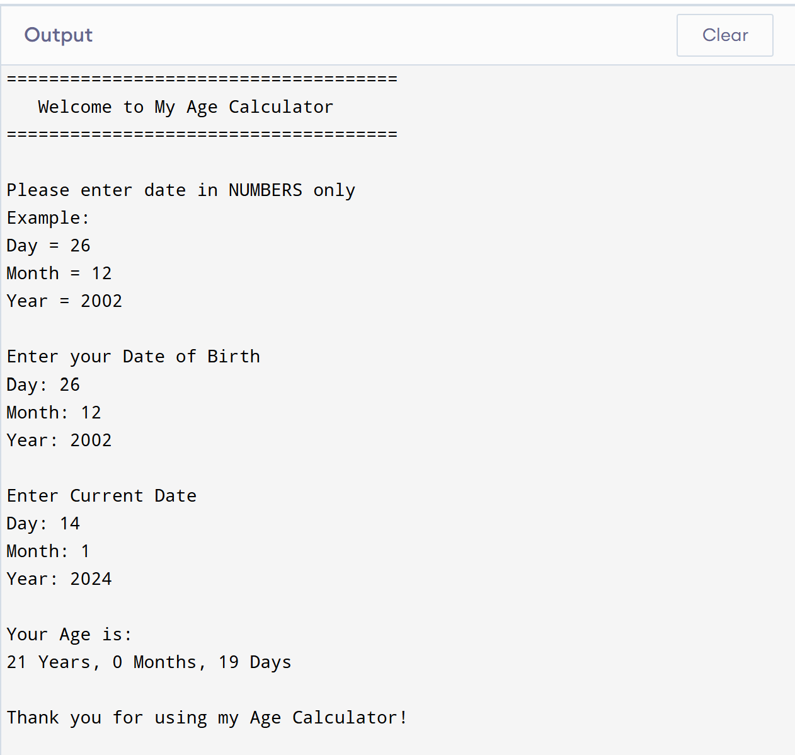

# Age Calculator (C Program)

This is a simple Age Calculator program written in C.  
The program calculates the user's age based on the date of birth entered and current date.

## Features

- Takes date of birth as input
- Calculates current age
- Displays age in years
- Simple command line program

## Technologies Used

- C Programming Language

## Program Output

## Author

Rifaq Ajmal
